# 猫粮投喂器

猫粮投喂器三维模型的 STEP 文件和多角度展示图片仓库。本仓库用于模型查看、结构展示和通用 CAD 格式共享，不包含 SolidWorks 源文件。

SolidWorks 2026 版本的装配体和零件源文件请前往：[AIChongZhi/mltwq](https://github.com/AIChongZhi/mltwq)

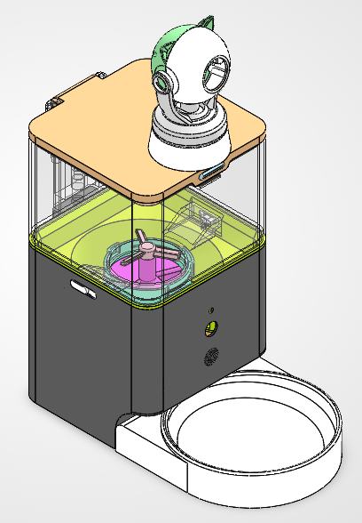

## 项目概览

该项目围绕猫粮储存、定量下料、粮道输送、接粮碗和猫咪活动观察展开设计，整体采用多层模块化布局。完整产品展示图包含猫粮盒盖上的监控摄像头；其他透视图和基础视图主要用于展示去掉摄像头后的内部结构与外观关系。

## 工作原理

### 自动投喂过程

1. 到达设定的喂食时间后，控制系统发出持续约 5 秒的电信号，使电机开始工作。
2. 电机依次带动一级带轮和二级带轮转动，通过带轮传动将动力传递至蜗杆。
3. 蜗杆头数为 1，蜗杆转动后带动齿轮转过设定角度。
4. 齿轮与拨片、拨粮器相连，三者同步转动。拨粮器将猫粮盒中的猫粮拨入下方的喂食装置，拨片同步推动猫粮，使猫粮沿粮道滑入喂食碗。
5. 完成一次下料后，电机停止工作，一次喂食过程完成。

### 摄像头功能

猫粮盒盖上的摄像头支持约 355° 的水平旋转，上下旋转角度可达 150°，能够覆盖较大的观察范围。摄像头可以识别猫咪活动，自动捕捉猫咪行为，并按设定间隔截取一帧图片上传至用户端，方便用户远程观察猫咪状态。

## 文件说明

| 目录 | 内容 | 用途 |
| --- | --- | --- |
| [`第一版-最终版本-step`](第一版-最终版本-step) | `.STEP` 文件 | 通用三维交换格式，可在其他 CAD 软件中查看或导入 |
| [`图片展示`](图片展示) | `.png` 文件 | 产品外观、透视结构和多视角展示图片 |

### 主要 STEP 文件

- [STEP 总装：装配.STEP](第一版-最终版本-step/装配.STEP)
- [拨粮器-3.STEP](第一版-最终版本-step/拨粮器-3.STEP)

仓库同时包含齿轮、蜗杆、带轮、转轴、轴承、粮道、猫粮盒、干燥盒、外壳、底座、接粮碗、电池及其他零件的 STEP 文件。

## 完整产品展示

以下“全景”系列图片展示的是带有猫粮盒盖监控摄像头的完整产品模型。

| 全景展示 | 全景正视 |
| --- | --- |
|  | 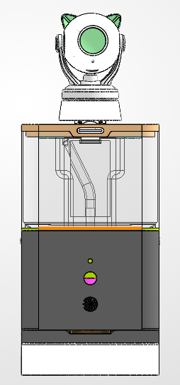 |

| 全景后视 | 全景右视 |
| --- | --- |
| 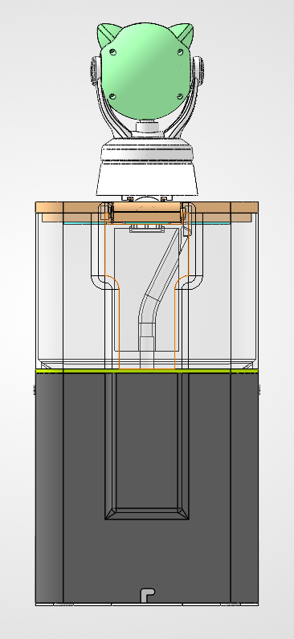 | 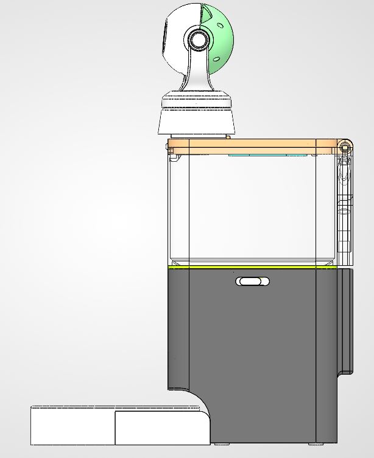 |

## 结构截图

以下图片为去掉猫粮盒盖监控摄像头后的模型截图，主要用于展示内部结构、透视关系和基础外观视图。

| 透视图 | 去掉摄像头的整体展示 |
| --- | --- |
| 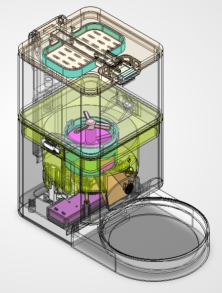 | 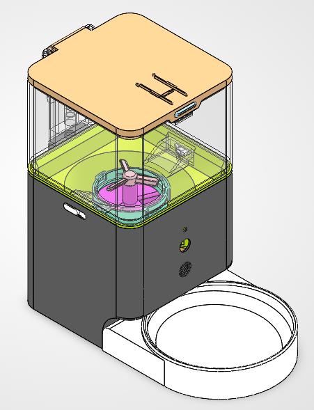 |

| 透视正视图 | 透视右视图 |
| --- | --- |
| 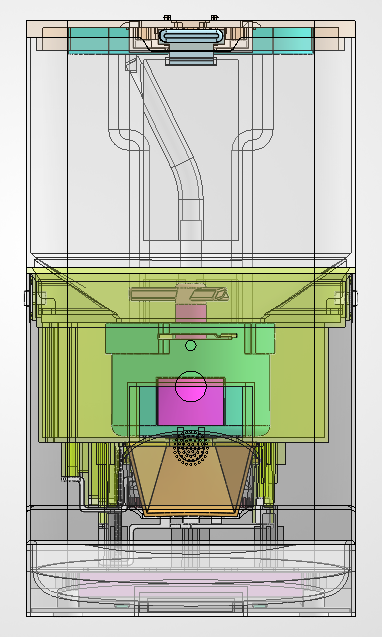 | 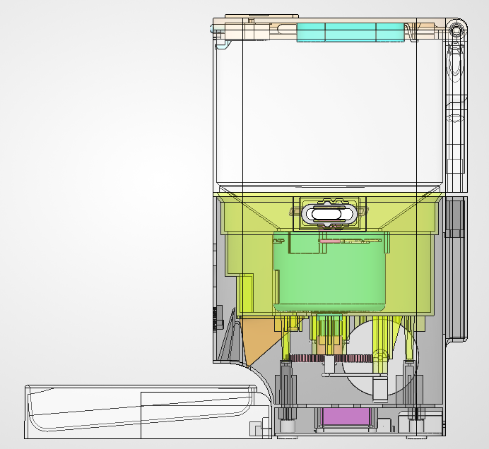 |

| 透视斜侧面 | 透视后视图 |
| --- | --- |
| 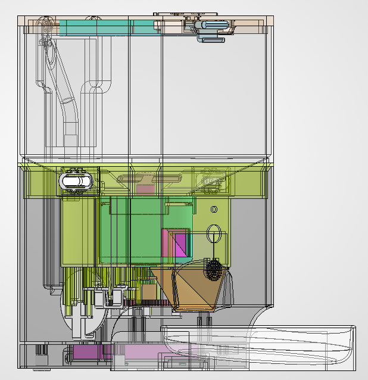 | 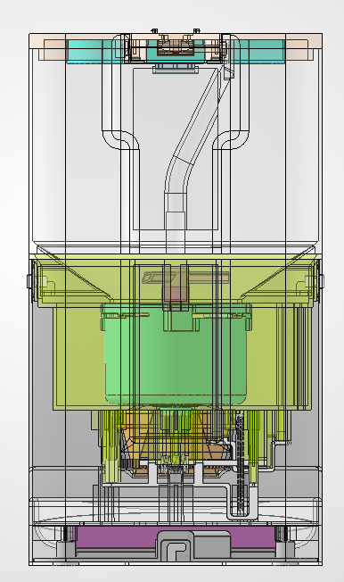 |

| 正视图 | 右视图 |
| --- | --- |
| 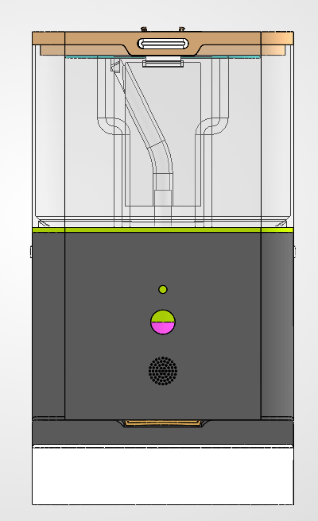 | 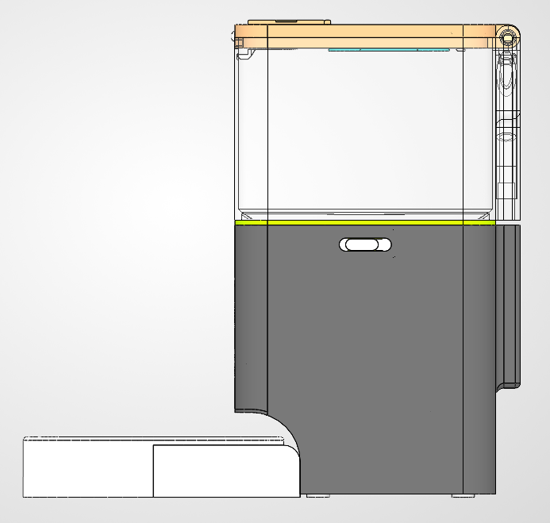 |

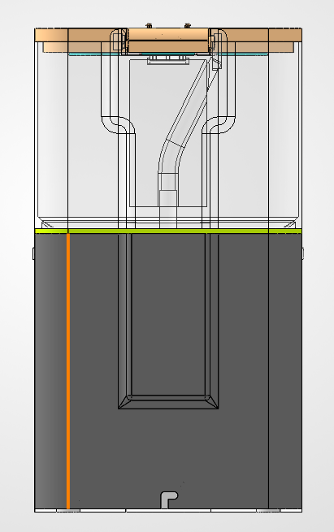

## 使用方式

1. 下载 [`第一版-最终版本-step`](第一版-最终版本-step) 目录中的 STEP 文件。
2. 使用支持 STEP 格式的 CAD 软件打开 `装配.STEP` 查看整体模型，或打开单个零件文件查看局部结构。
3. 如需编辑 SolidWorks 参数化模型，请前往 [AIChongZhi/mltwq](https://github.com/AIChongZhi/mltwq) 获取 `.SLDASM` 和 `.SLDPRT` 源文件。

## 注意事项

- STEP 文件通常不保留 SolidWorks 的参数化特征、装配约束和设计历史。
- SolidWorks 源文件使用 2026 版本保存，使用源文件时请注意版本兼容性。
- 样机制作前请根据实际电机、轴承、紧固件、食品接触材料和制造工艺重新确认尺寸、间隙、强度及公差。
- 本仓库未包含材料清单、驱动电路和控制程序。

## 许可证

当前仓库尚未声明开源许可证。除非获得作者明确授权，否则请不要将其中的模型文件用于商业生产、再发布或衍生项目。

## 作者

[@Hean-zky](https://github.com/Hean-zky)
